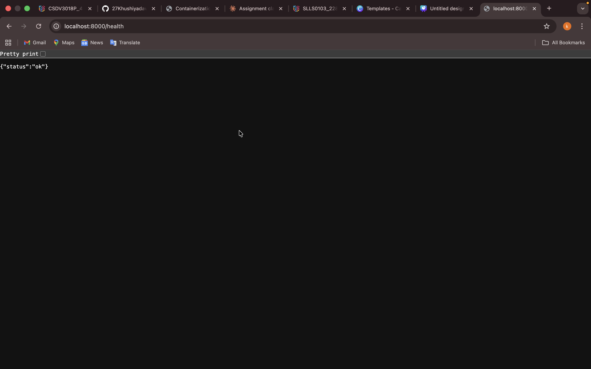
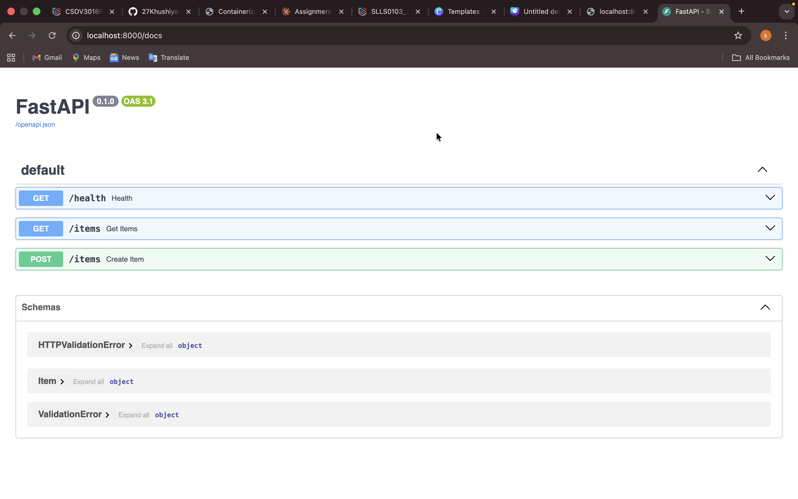
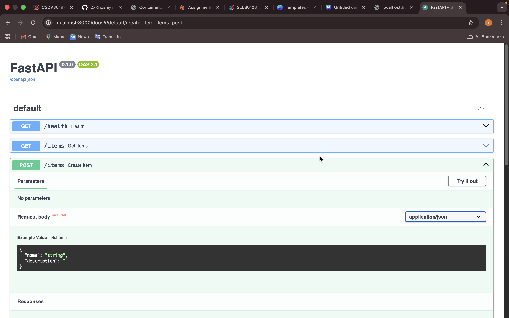
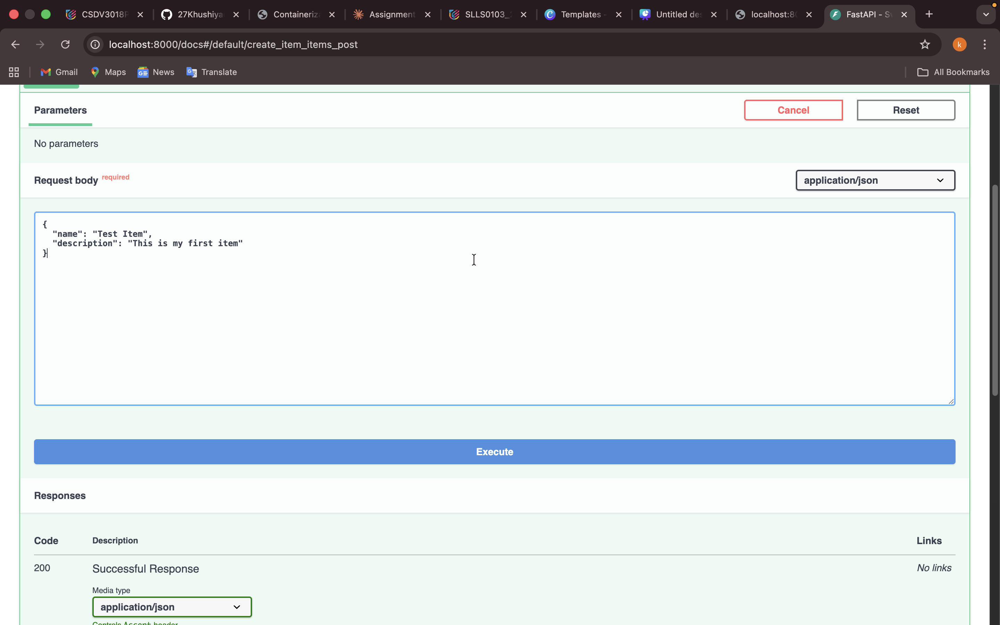
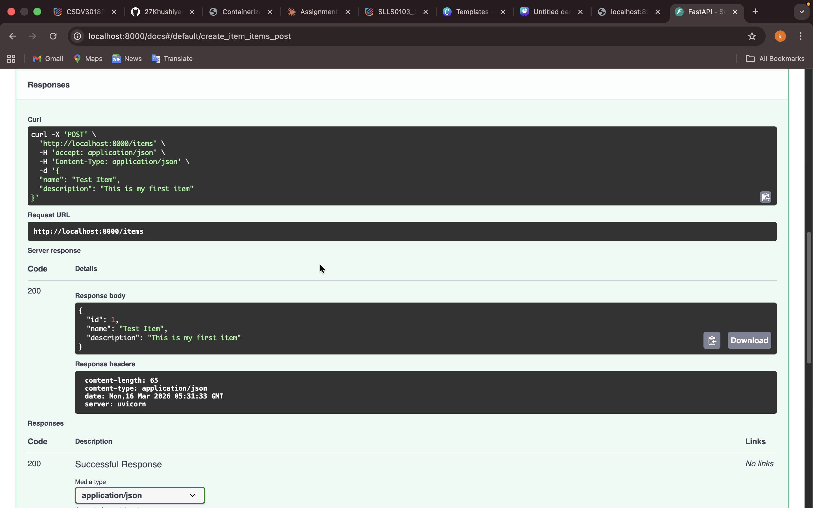
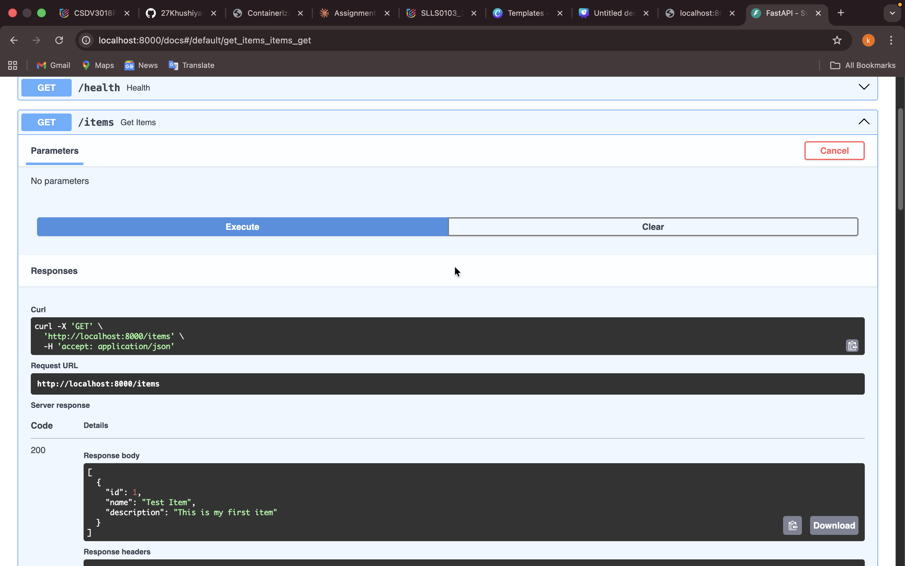
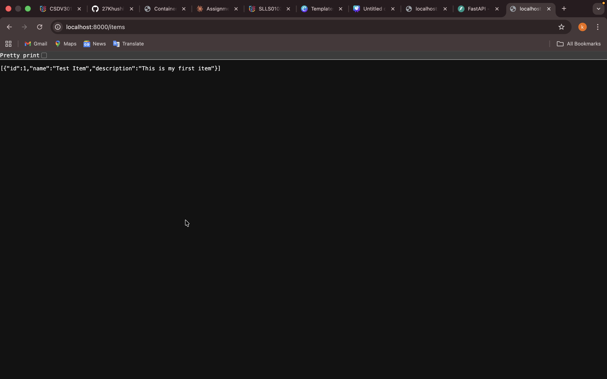
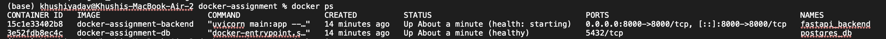
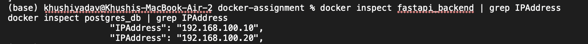
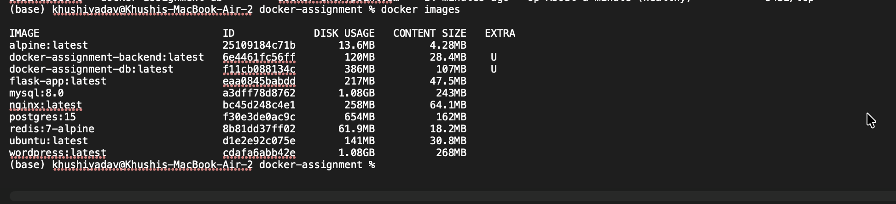

# DOCKER ASSIGNMENT
## Step-by-Step Commands Walkthrough
### Overview
This document records every single step taken to complete the Docker assignment from scratch on a MacBook Air. Each step includes the exact commands typed, the files created, and what the expected output looks like. Follow this document top to bottom to reproduce the entire project.
### 1. Create Project Folder Structure
Open VS Code. Press Cmd + ` to open the built-in terminal. Then run the following commands:

```bash
# Navigate to Desktop
cd ~/desktop

# Create the main project folder and subfolders
mkdir docker-assignment
cd docker-assignment
mkdir backend database

# Open the project in VS Code
code .
```
Expected Output:
Folder created: docker-assignment
- backend   <- FastAPI app will go here
- database   <- PostgreSQL Dockerfile will go here
### 2. Create the FastAPI Backend Application
In VS Code, create a new file inside the backend folder. Click on the backend folder in the left sidebar, then click the New File icon and name it main.py. Paste the following code:

File: backend/main.py
```bash
from fastapi import FastAPI
from pydantic import BaseModel
import psycopg2
import os
import time

app = FastAPI()

def get_db():
    return psycopg2.connect(
        host=os.getenv('DB_HOST', 'db'),
        database=os.getenv('DB_NAME', 'mydb'),
        user=os.getenv('DB_USER', 'myuser'),
        password=os.getenv('DB_PASSWORD', 'mypassword')
    )

@app.on_event('startup')
def startup():
    retries = 5
    while retries > 0:
        try:
            conn = get_db()
            cur = conn.cursor()
            cur.execute('''
                CREATE TABLE IF NOT EXISTS items (
                    id SERIAL PRIMARY KEY,
                    name TEXT NOT NULL,
                    description TEXT
                )
            ''')
            conn.commit()
            cur.close()
            conn.close()
            print('Table ready!')
            break
        except Exception as e:
            print(f'DB not ready... retrying ({e})')
            retries -= 1
            time.sleep(3)

@app.get('/health')
def health():
    return {'status': 'ok'}

class Item(BaseModel):
    name: str
    description: str = ''

@app.post('/items')
def create_item(item: Item):
    conn = get_db()
    cur = conn.cursor()
    cur.execute(
        'INSERT INTO items (name, description) VALUES (%s, %s) RETURNING id',
        (item.name, item.description)
    )
    new_id = cur.fetchone()[0]
    conn.commit()
    cur.close()
    conn.close()
    return {'id': new_id, 'name': item.name, 'description': item.description}

@app.get('/items')
def get_items():
    conn = get_db()
    cur = conn.cursor()
    cur.execute('SELECT id, name, description FROM items')
    rows = cur.fetchall()
    cur.close()
    conn.close()
    return [{'id': r[0], 'name': r[1], 'description': r[2]} for r in rows]

```
Now create the requirements file in the same backend folder:


File: backend/requirements.txt
```bash
fastapi==0.110.0
uvicorn==0.29.0
psycopg2-binary==2.9.9
pydantic==2.6.4

```
Now create the .dockerignore file to keep the image clean:

File: backend/.dockerignore

```bash
__pycache__
*.pyc
*.pyo
.env

```
### 3. Create the Backend Dockerfile
Create a new file inside the backend folder called Dockerfile (no extension). This uses a two-stage build: Stage 1 installs dependencies, Stage 2 creates the lean runtime image.

File: backend/Dockerfile


```bash
# ---- Stage 1: Builder ----
FROM python:3.11-alpine AS builder

WORKDIR /app

# Install build tools needed to compile psycopg2
RUN apk add --no-cache gcc musl-dev libpq-dev

COPY requirements.txt .
RUN pip install --prefix=/install --no-cache-dir -r requirements.txt


# ---- Stage 2: Runtime ----
FROM python:3.11-alpine

WORKDIR /app

# Only install the runtime library (not build tools)
RUN apk add --no-cache libpq

# Copy compiled packages from builder
COPY --from=builder /install /usr/local

# Copy application code
COPY main.py .

# Create and use non-root user for security
RUN adduser -D appuser
USER appuser

EXPOSE 8000

CMD ["uvicorn", "main:app", "--host", "0.0.0.0", "--port", "8000"]

```
### 4. Create the Database Dockerfile
Create a new file inside the database folder called Dockerfile. This builds a custom PostgreSQL image rather than using the default one directly, which is required by the assignment.

File: database/Dockerfile

```bash
FROM postgres:15-alpine

# Pre-configure database credentials
ENV POSTGRES_DB=mydb
ENV POSTGRES_USER=myuser
ENV POSTGRES_PASSWORD=mypassword

EXPOSE 5432

```
### 5. Create docker-compose.yml
Create docker-compose.yml in the ROOT of the project folder (not inside backend or database). This file ties everything together.

File: docker-compose.yml

```bash
version: '3.8'

services:

  backend:
    build:
      context: ./backend
      dockerfile: Dockerfile
    container_name: fastapi_backend
    environment:
      - DB_HOST=db
      - DB_NAME=mydb
      - DB_USER=myuser
      - DB_PASSWORD=mypassword
    ports:
      - '8000:8000'
    depends_on:
      db:
        condition: service_healthy
    restart: always
    healthcheck:
      test: ['CMD', 'wget', '--spider', '-q', 'http://localhost:8000/health']
      interval: 30s
      timeout: 10s
      retries: 3
    networks:
      app_network:
        ipv4_address: 192.168.100.10

  db:
    build:
      context: ./database
      dockerfile: Dockerfile
    container_name: postgres_db
    environment:
      - POSTGRES_DB=mydb
      - POSTGRES_USER=myuser
      - POSTGRES_PASSWORD=mypassword
    volumes:
      - pgdata:/var/lib/postgresql/data
    restart: always
    healthcheck:
      test: ['CMD-SHELL', 'pg_isready -U myuser -d mydb']
      interval: 10s
      timeout: 5s
      retries: 5
    networks:
      app_network:
        ipv4_address: 192.168.100.20

volumes:
  pgdata:

networks:
  app_network:
    driver: bridge
    ipam:
      config:
        - subnet: 192.168.100.0/24
          gateway: 192.168.100.1

```
Your final folder structure should now look exactly like this:

```bash
docker-assignment/
  backend/
    main.py
    requirements.txt
    Dockerfile
    .dockerignore
  database/
    Dockerfile
  docker-compose.yml

```
### 6. Build and Run the Application
Make sure you are inside the docker-assignment folder in your terminal. Then run:

```bash
# Make sure you are in the right folder
cd ~/desktop/docker-assignment

# Build images and start all containers
docker compose up --build
```
### 7. Test the API Endpoints
Open your browser and go to this URL to see the interactive API documentation:
```bash
Open this URL in your browser
http://localhost:8000/docs
```
Or test each endpoint directly in the browser / terminal:

#### Test 1 -- Healthcheck endpoint:

```bash
http://localhost:8000/health
```
Expected Output:
- {"status": "ok"}




#### Test 2 -- Insert a record (use the /docs page or Postman):

```bash
# POST to /items with this JSON body:
{"name": "Test Item", "description": "My first item"}
```
Expected Output:
- {"id": 1, "name": "Test Item", "description": "My first item"}



#### Test 3 -- Fetch all records:
```bash
http://localhost:8000/items
```
Expected Output:
- [{"id": 1, "name": "Test Item", "description": "My first item"}]



### 8. Take Required Screenshots
Open a NEW terminal tab (press Cmd + T) while the containers are still running. Run each command below and take a screenshot after each one.

#### Screenshot 1 -- Running containers:
```bash
docker ps
```


#### Screenshot 2 -- Network inspect:
```bash
docker network inspect docker-assignment_app_network
```


#### Screenshot 3 -- Container IP addresses:
```bash
docker inspect fastapi_backend | grep IPAddress
docker inspect postgres_db | grep IPAddress
```

#### Screenshot 4 -- Image sizes:
```bash
docker images
```


#### Screenshot 5 -- Volume exists:
```bash
docker volume ls
```


#### Screenshot 6 -- Volume persistence test:
```bash
# 1. Insert data via POST /items in the browser first
# 2. Then restart the containers:
docker compose restart
```


