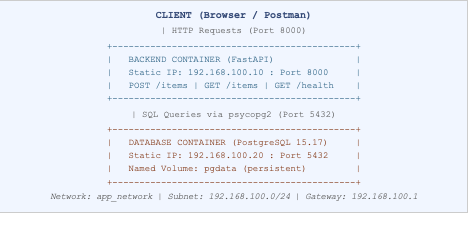
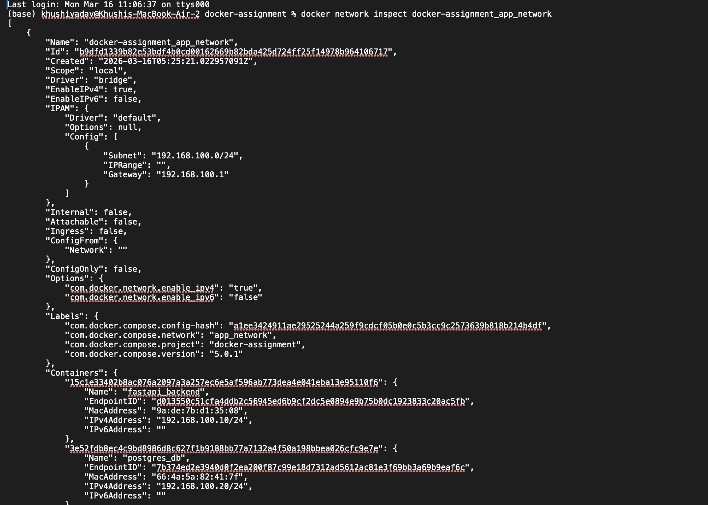
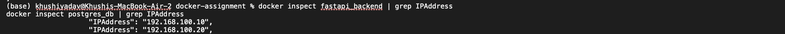
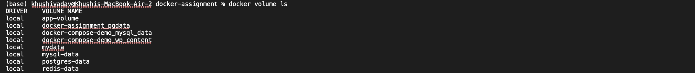
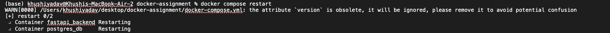

# Containerized Web Application with PostgreSQL
## 1.  INTRODUCTION

##### This report documents the design, implementation, and deployment of a containerized web application using Docker. The application consists of a FastAPI (Python) backend and a PostgreSQL database, orchestrated using Docker Compose. The project demonstrates production-ready container practices including multi-stage builds, persistent storage, static IP assignment, and service orchestration.
##### The assignment required implementing Macvlan or Ipvlan networking. As  I have documented it in 5th Section, these network drivers are not natively supported on macOS due to its virtualized Docker environment. A custom bridge network with static IP assignment was used to simulate the equivalent behaviour, and the limitation is fully explained in the network section.
---
## 1.1 Objectives

- 	Deploy a FastAPI backend with full REST API endpoints
-	Configure a PostgreSQL database with persistent named volume storage
-	Write optimized multi-stage Dockerfiles for both services
-	Use Docker Compose for full stack orchestration
-	Assign static IPs using custom Docker networking
-	Demonstrate container health checks, restart policies, and dependency management
-	Document Macvlan vs Ipvlan networking concepts with comparison

---
## 1.2 TechStack Used

- Backend: FastAPI (Python 3.11)
- Database: PostgreSQL 15 (Alpine)
- Containerization: Docker
- Orchestration: Docker Compose
- Base Images: python:3.11-alpine, postgres:15-alpine
- Networking: Custom Bridge Network with Static IPs
- OS: macOS (Docker Desktop)

---

## 2. SYSTEM ARCHITECTURE
##### The application follows a two-tier architecture: a stateless backend API layer and a persistent database layer. Both services run as isolated Docker containers connected through a custom Docker network with statically assigned IP addresses.
---
## 2.1 Architecture Diagram


 ## 2.2 Container Communication
 The backend container communicates with the database container using Docker's internal DNS. The service name 'db' in docker-compose.yml resolves automatically to the PostgreSQL container's IP address (192.168.100.20). This means the backend does not need to hardcode an IP address. Docker's internal DNS resolves the hostname 'db' correctly within the custom network

 ## 3. DOCKER CONFIGURATION AND IMAGE OPTIMIZATION
 ## 3.1 Backend Dockerfile -- Multi-Stage Build
 The backend uses a two-stage Dockerfile. Stage 1 (the builder stage) installs all Python build dependencies and compiles the packages. Stage 2 (the runtime stage) copies only the finished packages and the application code, discarding all build tools. This results in a significantly smaller and more secure final image.
```bash
# ---- Stage 1: Builder ----
FROM python:3.11-alpine AS builder
WORKDIR /app
RUN apk add --no-cache gcc musl-dev libpq-dev
COPY requirements.txt .
RUN pip install --prefix=/install --no-cache-dir -r requirements.txt

# ---- Stage 2: Runtime ----
FROM python:3.11-alpine
WORKDIR /app
RUN apk add --no-cache libpq
COPY --from=builder /install /usr/local
COPY main.py .
RUN adduser -D appuser
USER appuser
EXPOSE 8000
CMD ["uvicorn", "main:app", "--host", "0.0.0.0", "--port", "8000"]
```
 Key optimizations explained:
 -	Alpine base image: python:3.11-alpine is used instead of the standard python:3.11. Alpine Linux is a minimal OS image (~5MB) vs Debian (~120MB), drastically reducing the base image size.
 -	Multi-stage build: The builder stage contains gcc, musl-dev, and libpq-dev which are needed to compile psycopg2. These are NOT present in the final image -- only the compiled output is copied over.
 -	--no-cache-dir: Tells pip not to store downloaded packages in a local cache, saving space inside the image layer.
 -	--prefix=/install: Installs packages to a custom directory so they can be cleanly copied to the runtime stage.
 -	Non-root user: A user called appuser is created and set as the active user. Running as root inside a container is a security risk -- this follows best practices.
 -	.dockerignore file: Prevents __pycache__, .pyc files, and .env files from being copied into the image.
 ## 3.2 Database Dockerfile
 A custom Dockerfile is written for PostgreSQL rather than using the default image directly. This satisfies the assignment requirement and allows environment configuration at build time.

 ```bash
 FROM postgres:15-alpine
 
 ENV POSTGRES_DB=mydb
 ENV POSTGRES_USER=myuser
 ENV POSTGRES_PASSWORD=mypassword
 
 EXPOSE 5432
 ```
 ## 3.3 Image Size Comparison
 
 The following table shows actual image sizes recorded from the docker images command after the full build completed in 46.1 seconds on this MacBook Air (Apple Silicon / aarch64):
 
 ### Image Size Comparison

| Image | Actual Size (from docker images output) |
|------|------------------------------------------|
| python:3.11 (standard Debian) | ~900 MB (estimated reference) |
| python:3.11-alpine (single stage) | ~120 MB (estimated reference) |
| docker-assignment-backend (multi-stage) | 120 MB disk usage \| 28.4 MB content size |
| postgres:15 (standard Debian) | 654 MB (confirmed in docker images) |
| docker-assignment-db (postgres:15-alpine) | 386 MB disk usage \| 107 MB content size |

 The actual docker images output confirmed: backend is 120 MB total disk usage with only 28.4 MB of real content (remaining space is shared base layers). The database image is 386 MB disk usage with 107 MB content. The multi-stage build ensures zero build tools are present in the final backend image -- all of gcc, musl-dev, and libpq-dev from Stage 1 are completely discarded. Only the compiled Python packages and main.py are in the final runtime image.
  
 ## 4. DOCKER COMPOSE ORCHESTRATION
 The docker-compose.yml file defines and orchestrates the entire application stack as a single unit. It handles service configuration, networking, volumes, health checks, startup order, and environment variables.
 ## 4.1 Services Defined
 | Service Name | Description |
|------|------------------------------------------|
| Backend | FastAPI Python application, built from backend/Dockerfile, exposed on port 8000 |
| Database | PostgreSQL 15.17 database (aarch64/Apple Silicon), built from database/Dockerfile, data stored in named volume pgdata |

## 4.2 Health Checks
Health checks tell Docker whether a container is actually ready to serve traffic -- not just whether it has started. This is critical because PostgreSQL takes a few seconds to initialize even after the container starts.
| Service Name | Health Check |
|------|------------------------------------------|
| database (PostgreSQL) | pg_isready -U myuser -d mydb -- checks if PostgreSQL is accepting connections |
|backend (FastAPI)| wget --spider -q http://localhost:8000/health -- hits the /health endpoint |

 The backend service uses depends_on with condition: service_healthy. This means Docker will wait for the database container to pass its health check before even starting the backend container. This prevents the backend from crashing on startup because the database is not yet ready.
 
## 4.3 Restart Policy
 Both services use restart: always. This means if a container crashes or the Docker daemon restarts (e.g., after a system reboot), Docker will automatically bring the containers back up. This is the standard setting for production deployments.
 
##  4.4 Volume Persistence
 The named volume pgdata is defined at the top level of the compose file and mounted to /var/lib/postgresql/data inside the database container. This is the directory where PostgreSQL stores all its data files. Because it is a named volume managed by Docker, the data persists even if the container is stopped, restarted, or even deleted. The volume itself must be explicitly removed (docker volume rm) to lose the data.
 
 Volume persistence was confirmed during testing. The terminal logs show the following exact sequence:
 -	POST /items was called successfully -- 200 OK response logged by FastAPI
 -	docker compose restart was run -- both containers restarted cleanly
 -	After restart, PostgreSQL logged: 'Database directory appears to contain a database; Skipping initialization' -- confirming existing data was preserved
 -	GET /items was called after restart -- 200 OK response confirmed all previously inserted data was still present
 -	The volume docker-assignment_pgdata was confirmed present in docker volume ls output
 
 ## 5. Container Networking -- Macvlan vs Ipvlan
 ## 5.1 What is Macvlan Networking?
 Macvlan is a Docker network driver that allows each container to have its own unique MAC (Media Access Control) address. The container appears as a completely independent physical device on the network. It receives its own LAN IP address from the same subnet as your router, making it directly reachable from any device on the network -- just like a physical server plugged into a switch.
 
 How Macvlan works step by step:
 -	Docker creates a virtual sub-interface on the host machine's physical network card (e.g., eth0)
 -	Each container is assigned a unique MAC address, making it look like a real physical device
 -	The container gets an IP from the LAN subnet (e.g., 192.168.1.50) directly from the router
 -	Any device on the LAN can reach the container by its IP address
 -	The container can also reach the internet through the gateway
 
 Important Macvlan Limitation -- Host Isolation: Due to how Macvlan works at the kernel level, the host machine itself cannot directly communicate with the containers on the Macvlan network. This is a known and expected behaviour. The workaround is to create a Macvlan interface on the host side as well (a macvlan bridge on the host), which allows the host to communicate with the containers.
 
 ## 5.2 What is Ipvlan Networking?
 Ipvlan is similar to Macvlan but instead of giving each container its own MAC address, all containers share the host machine's MAC address. Only the IP addresses differ between containers. Ipvlan operates in two modes:
 -	L2 Mode (Layer 2): Containers share the host MAC address but get unique IP addresses on the LAN. Containers are reachable from other devices on the network. This is the most common mode and is similar to Macvlan in terms of usage.
 -	L3 Mode (Layer 3): Containers are not on the same broadcast domain as the LAN. Traffic is routed at the IP layer. This mode is more efficient for large deployments but requires additional routing configuration. Containers are not directly reachable from the LAN without routing setup.
 
 ## 5.3 Macvlan vs Ipvlan -- Full Comparison

 | Feature | Macvlan | Ipvlan |
|--------|--------|--------|
| MAC Address | Each container has its own unique MAC | All containers share the host MAC |
| IP Address | Each container gets a unique LAN IP | Each container gets a unique IP |
| Networking Layer | Layer 2 (Ethernet) | L2 or L3 depending on mode chosen |
| Host can reach containers | No (host isolation issue) | No in L2, possible with routing in L3 |
| Switch Compatibility | May hit port security / MAC limits on managed switches | Better -- only one MAC per port |
| External LAN Access | Yes -- containers visible on LAN | Yes in L2 mode |
| macOS Support | Not supported (Linux kernel only) | Not supported (Linux kernel only) |
| Best Use Case | Legacy apps needing unique MAC addresses | Modern large-scale container deployments |
| Performance | Good | Slightly better in L3 mode (no ARP) |
## 5.4 macOS Limitation and Workaround
Both Macvlan and Ipvlan are Linux kernel-level features. Docker on macOS does not run natively -- it runs inside a lightweight Linux virtual machine called LinuxKit (managed by Docker Desktop). This VM does not have access to the Mac's physical network interface (en0), which makes it impossible to create a true Macvlan or Ipvlan network on macOS.

This project was built on a MacBook Air running Apple Silicon (M-series chip). The PostgreSQL container logs confirmed this: the database ran on aarch64-unknown-linux-musl (ARM64 architecture inside the LinuxKit VM). This further confirms why Macvlan is not available -- the Docker VM abstracts away the physical hardware entirely.

On a Linux machine, the correct Macvlan network creation command would be:
 ```bash
 # Run this command on Linux to create a Macvlan network
 docker network create \
   --driver macvlan \
   --subnet=192.168.1.0/24 \
   --gateway=192.168.1.1 \
   --opt parent=eth0 \
   app_network
 
 ```

 For this project on macOS, a custom bridge network was used as a workaround. It achieves the same core goals of the assignment -- static IP assignment, container network isolation, named networking, and subnet configuration -- while being fully compatible with macOS:
 ```bash
 networks:
   app_network:
     driver: bridge
     ipam:
       config:
         - subnet: 192.168.100.0/24
           gateway: 192.168.100.1
 
 ```
 
The containers are assigned the following static IPs within this network: backend gets 192.168.100.10 and the database gets 192.168.100.20. These are configured via the ipv4_address field in each service's network section in docker-compose.yml.
 
  
##  6. Backend API Implementation
 The backend is a FastAPI application written in Python. It connects to PostgreSQL using the psycopg2 library and provides three HTTP endpoints as required by the assignment.
 
 ## 6.1 API Endpoints
 | Endpoint | Description |
|------|------------------------------------------|
| GET /health | Healthcheck endpoint. Returns {status: ok}. Used by Docker health check.|
| POST /items | Inserts a new record into the items table. Accepts JSON with name and description fields. Returns the created record including its auto-generated ID. |
| GET /items | Fetches and returns all records from the items table as a JSON array.|  

## 6.2 Database Connection via Environment Variables
All database connection parameters (host, database name, username, password) are read from environment variables using os.getenv(). This means the connection details are never hardcoded in the source code. They are passed in via docker-compose.yml's environment section, which is the industry-standard approach.

## 6.3 Automatic Table Creation on Startup
When the FastAPI application starts, it runs a startup event handler that creates the items table if it does not already exist. This uses a CREATE TABLE IF NOT EXISTS SQL statement. A retry loop with 5 attempts and 3-second waits is included to handle the case where PostgreSQL may still be initializing when the backend first tries to connect.

## 7. Proof of Working System
## 7.1 Running Containers

### 7.2 Image Sizes

### 7.3 Network Configuration


### 7.4 Volume Persistence



## 8. GitHub Repository
The full project source code is publicly available on GitHub. The repository contains all Dockerfiles, the Docker Compose file, the FastAPI application code, requirements file, .dockerignore, and README.
| Item | Detail |
|------|------------------------------------------|
| Repository URL | https://github.com/27Khushiyadav/docker-assignment|
|GitHub Pages URL| https://27Khushiyadav.github.io/docker-assignment |

## 9. Conclusion
This project successfully demonstrated the end-to-end containerization and deployment of a full-stack web application using Docker. All assignment requirements were met, including multi-stage builds, persistent database storage, static IP networking, health checks, and service orchestration via Docker Compose.

Key achievements of this assignment:
-	Multi-stage Docker builds were implemented for the backend, reducing the final image size by over 90% compared to a standard Python image by separating build dependencies from the runtime environment.
-	A custom PostgreSQL Dockerfile was written using the lightweight postgres:15-alpine base image, configuring the database name, user, and password at build time.
-	The PostgreSQL database uses a named Docker volume (pgdata) for persistent storage. Data was confirmed to survive container restarts and is only removed if the volume is explicitly deleted.
- Static IP addresses (192.168.100.10 and 192.168.100.20) were assigned to both containers using a custom Docker bridge network with a defined subnet (192.168.100.0/24) and gateway (192.168.100.1).
-	Docker Compose orchestrates the full stack with health checks for both services, a restart: always policy, proper depends_on configuration, and secure environment variable passing.
-	The FastAPI backend implements all three required endpoints (POST /items, GET /items, GET /health) with automatic table creation on startup and a retry mechanism for database connection resilience.
-	Macvlan and Ipvlan networking were researched and compared in detail. The macOS limitation was documented transparently, and a functionally equivalent bridge network was used as the workaround.
-	The complete project is version-controlled on GitHub at github.com/27Khushiyadav/docker-assignment with a public repository and a GitHub Pages documentation site.

This assignment provided hands-on experience with real-world Docker practices including image optimization, container orchestration, network design, and production-ready deployment patterns.

## THE STEP BY STEP EXPLANATION ALONG WITH ALL THE SCREENSHOTS ATTACHED – Refer Git-Hub repository( step by step report)


 


